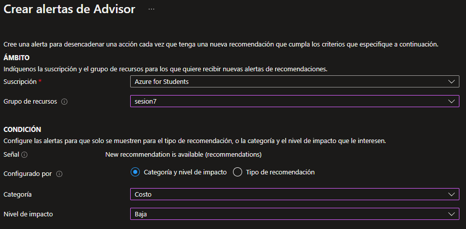

# Sesion 7

## Practica 1

**Azure service health** es un servicio que nos informa de los problemas actuales y futuros que puedan afectar al servicio

Para crear una alerta en service health tenemos que dirigirnos a [Azure](https://portal.azure.com)

Nos vamos al buscador de azure y escribimos Service health

Para crear una alerta en service health le damos click en crear alerta 

Ahora configuraremos la alerta para que nos notifique algun problema

Seleccionamos grupos de acciones y llenamos lo que nos pide

Ahora nos seleccionaremos el apartado notificaciones donde seleccionaremos el medio por el cual seremos notificados

Una vez creada la alerta, podemos probarla con la opcion grupo de acciones de prueba y seleccionamos alerta de estado del servicio como ejemplo 

Y como resultado obtendriamos este correo de la alerta

## Practica 2

Creamos una maquina virtual y la conectamos

Ahora creamos una alerta para la maquina virtual y seleccionamos el porcentaje de cpu

Y creamos la alerta

Notifica cuando advisor detecta un cambio, mejora el entorno de nube (reduce costos, mayor seguridad)

## Practica 3

ARM (Azure Resource Manager) es el que crea los recursos, nosotros podemos hacer nuestra plantilla en vscode y para eso creamos un archivo al que llamaremos azuredeploy.js

Esto es lo mínimo que debemos tener para crear una plantilla de ARM

Para subir la plantilla a azure debemos abrir un cmd en la ubicación del archivo y ponemos lo siguiente

Cuando aparece running significa que pasó la primera validación de azure 

Asi aparece nuestra plantilla cuando ya ha sido creada, ahora implementaremos un storage account en nuestra plantilla

Esta sería la serie de comandos para implementar un storage account

Volvemos a ingresar la línea de comandos

Aquí podemos ver la cuenta de almacenamiento ya hecha

# Sesion7
# Sesion7
# Sesion7
